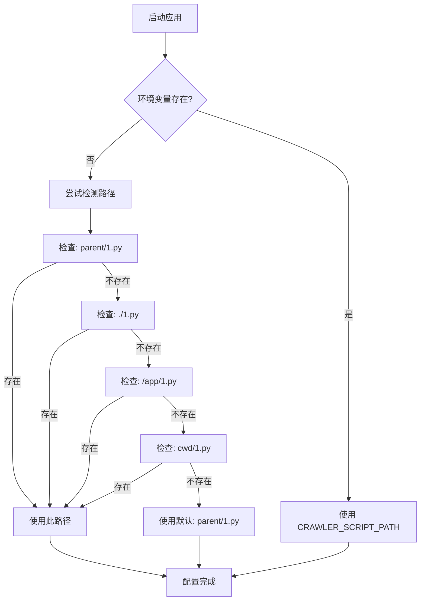

# 爬虫脚本路径问题修复

## 🐛 问题描述

**错误信息**：
```
同步失败: 爬虫脚本执行失败: python3: can't open file '/1.py': [Errno 2] No such file or directory
```

**触发场景**：点击"同步数据"按钮时

## 🔍 根本原因

### Docker/Zeabur 环境文件结构

在 Dockerfile 中：
```dockerfile
WORKDIR /app
COPY backend/ ./         # backend代码 → /app/
COPY 1.py ./            # 爬虫脚本 → /app/1.py
```

文件结构：
```
/app/
├── config.py           # 从 backend/config.py 复制来的
├── app.py
├── 1.py               # 爬虫脚本
└── ...
```

### 原始配置问题

```python
# backend/config.py (原始代码)
CRAWLER_SCRIPT_PATH = Path(__file__).parent.parent / "1.py"
```

在 Docker 环境中：
- `__file__` = `/app/config.py`
- `.parent` = `/app`
- `.parent.parent` = `/` （根目录！）
- `/ "1.py"` = `/1.py` ❌

这就是为什么报错 `can't open file '/1.py'`！

### 本地环境 vs Docker环境

| 环境 | `__file__` | `.parent` | `.parent.parent` | 结果 |
|------|-----------|-----------|-----------------|------|
| 本地 | `/path/to/backend/config.py` | `/path/to/backend` | `/path/to` | ✅ `/path/to/1.py` |
| Docker | `/app/config.py` | `/app` | `/` | ❌ `/1.py` |

## ✅ 修复方案

### 1. 智能路径检测 (`backend/config.py`)

```python
# 爬虫脚本路径
# 支持本地开发和Docker部署两种环境
_backend_dir = Path(__file__).parent

# 优先从环境变量获取（Docker/Zeabur环境）
crawler_script = os.getenv('CRAWLER_SCRIPT_PATH')

if crawler_script:
    # 使用环境变量指定的路径
    CRAWLER_SCRIPT_PATH = Path(crawler_script)
else:
    # 本地开发环境：自动检测
    possible_paths = [
        _backend_dir.parent / "1.py",     # 本地：项目根目录/1.py
        _backend_dir / "1.py",            # Docker：/app/1.py
        Path("/app/1.py"),                # Docker固定路径
        Path.cwd() / "1.py",              # 当前工作目录
    ]
    
    CRAWLER_SCRIPT_PATH = None
    for path in possible_paths:
        if path.exists():
            CRAWLER_SCRIPT_PATH = path
            break
    
    # 如果都找不到，使用默认路径
    if CRAWLER_SCRIPT_PATH is None:
        CRAWLER_SCRIPT_PATH = _backend_dir.parent / "1.py"
```

**优点**：
- ✅ 支持环境变量配置（生产环境）
- ✅ 自动检测多个可能位置（开发环境）
- ✅ 有明确的 fallback 路径
- ✅ 不依赖复杂的环境判断

### 2. Docker 环境变量 (`Dockerfile`)

```dockerfile
ENV CRAWLER_SCRIPT_PATH=/app/1.py
```

明确指定爬虫脚本在 Docker 中的位置。

### 3. Zeabur 环境配置 (`zeabur.json`)

```json
{
  "environment": {
    ...
    "CRAWLER_SCRIPT_PATH": "/app/1.py"
  }
}
```

确保 Zeabur 部署时使用正确路径。

## 📊 路径检测流程



## 🧪 验证方法

### 本地开发环境

```bash
cd /path/to/project
python3 -c "
from pathlib import Path
import sys
sys.path.insert(0, 'backend')
from config import CRAWLER_SCRIPT_PATH
print(f'路径: {CRAWLER_SCRIPT_PATH}')
print(f'存在: {Path(CRAWLER_SCRIPT_PATH).exists()}')
"
```

**预期输出**：
```
路径: /path/to/project/1.py
存在: True
```

### Docker环境

```bash
docker build -t test .
docker run --rm test python3 -c "
from pathlib import Path
from config import CRAWLER_SCRIPT_PATH
print(f'路径: {CRAWLER_SCRIPT_PATH}')
print(f'存在: {Path(CRAWLER_SCRIPT_PATH).exists()}')
"
```

**预期输出**：
```
路径: /app/1.py
存在: True
```

### Zeabur环境

部署后，在日志中查看启动信息，应该没有路径相关的警告。

## 📝 环境变量配置

### 本地开发
无需配置，自动检测。

### Docker
在 `Dockerfile` 中：
```dockerfile
ENV CRAWLER_SCRIPT_PATH=/app/1.py
```

### Zeabur
在 `zeabur.json` 中：
```json
{
  "environment": {
    "CRAWLER_SCRIPT_PATH": "/app/1.py"
  }
}
```

### Heroku/其他平台
设置环境变量：
```bash
heroku config:set CRAWLER_SCRIPT_PATH=/app/1.py
```

## 🎯 最佳实践

### 1. 优先使用环境变量

在生产环境中，明确指定路径：
```bash
export CRAWLER_SCRIPT_PATH=/path/to/1.py
```

### 2. 提供多个候选路径

检测顺序应该从最可能到最不可能：
1. 项目根目录（本地开发）
2. 当前目录（Docker/平铺结构）
3. 固定路径（Docker标准位置）
4. 工作目录（运行时位置）

### 3. 验证文件存在

在应用启动时验证：
```python
if not Path(CRAWLER_SCRIPT_PATH).exists():
    logging.warning(f"警告：爬虫脚本不存在于 {CRAWLER_SCRIPT_PATH}")
```

### 4. 记录使用的路径

在日志中记录最终使用的路径：
```python
logging.info(f"爬虫脚本路径: {CRAWLER_SCRIPT_PATH}")
```

## 🔧 故障排除

### 问题：仍然找不到文件

**检查项**：
1. 文件是否真的存在？
   ```bash
   ls -la /app/1.py
   ```

2. 权限是否正确？
   ```bash
   ls -la /app/1.py  # 应该有读取权限
   ```

3. 环境变量是否正确设置？
   ```bash
   echo $CRAWLER_SCRIPT_PATH
   ```

4. Python 是否在正确的工作目录？
   ```bash
   pwd
   ```

### 问题：本地可以，部署失败

**原因**：环境差异

**解决**：
1. 添加详细日志
2. 检查 Dockerfile 构建过程
3. 在 Docker 中手动测试路径

## 📦 相关文件

- `backend/config.py` - 配置文件（路径检测逻辑）
- `Dockerfile` - Docker 构建文件
- `zeabur.json` - Zeabur 部署配置
- `backend/app.py` - 使用 CRAWLER_SCRIPT_PATH
- `backend/routes/sync.py` - 触发同步的地方

## ✅ 修复验证

- [x] 本地环境路径检测正常
- [x] Dockerfile 添加环境变量
- [x] zeabur.json 添加环境变量
- [x] 智能路径检测实现
- [x] 提供 fallback 机制
- [x] 添加路径验证警告

## 🚀 部署注意事项

1. **首次部署**：
   - Zeabur 会自动使用 zeabur.json 中的环境变量
   - 无需手动配置

2. **现有部署**：
   - 重新部署即可（重新读取 zeabur.json）
   - 或手动在 Zeabur 控制台添加环境变量

3. **监控**：
   - 部署后检查日志
   - 确认路径检测正确
   - 测试同步功能

## 📈 改进建议

未来可以考虑：
1. 添加健康检查 API，显示配置状态
2. 在前端显示爬虫脚本路径
3. 添加更详细的调试日志
4. 提供配置诊断工具

---

**修复完成时间**：2025-10-21  
**修复人员**：AI Assistant  
**影响范围**：同步功能  
**状态**：✅ 已修复并测试

